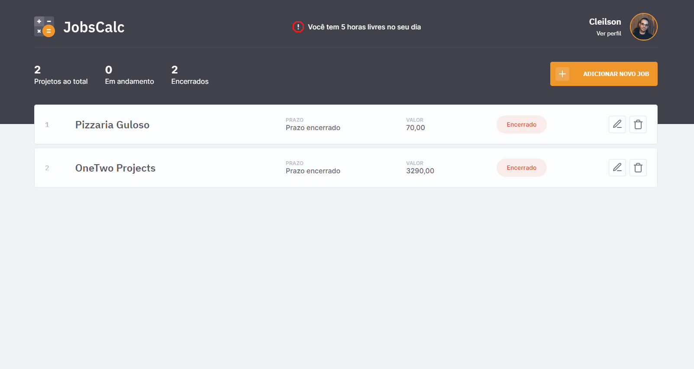

<div align="center">
  <h1>JobsCalc</h1>
  <p>JobsCalc é uma aplicação de estimativa de cálculo para projetos freelancer, onde é possível cadastrar e excluir jobs (projetos), obtendo uma estimativa de custo de cada job. Além disso, é possível estimar o valor da hora da pessoa que estará usando o sistema.</p>
  
</div>

# 📒 Índice
* [Descrição](#descrição)
* [Requisitos Funcionais](#requisitos)
  * [Features](#features)
* [Tecnologias](#tecnologias)
* [Design](#design)
  * [Cores](#cores)
  * [Fontes](#fontes)
* [Instalação](#instalação)
* [Licença](#licença)

# 📃 <span id="descrição">Descrição</span>
JobsCalc é uma aplicação de estimativa de cálculo para projetos freelancer, onde é possível cadastrar e excluir jobs (projetos), obtendo uma estimativa de custo de cada job. Além disso, é possível estimar o valor da hora da pessoa que estará usando o sistema, com base no próprio cadastro. Aplicação desenvolvida completa utilizando banco de dados, servidor, front. Utilizando tecnologias: [**NodeJS**](https://nodejs.org/en), o framework [**Express**](https://expressjs.com/pt-br/) e banco de dados [**SQLite**](https://www.sqlite.org/).

# 📌 <span id="requisitos">Requisitos Funcionais</span>
- [x] Cadastro de informações do usuário<br>
- [x] Cadastro de meta de valor mensal<br>
- [x] Cadastro de horas a trabalhar no dia<br>
- [x] Cadastro de semanas para descanso no no ano<br>
- [x] Cadastro de dias a trabalhar na semana<br>
- [x] Calculo do orçamento total para o trabalho<br>
- [x] Calculo de dias restantes para termino do projeto<br>
- [x] Exibir valor da hora<br>
- [x] Exibição de dias restantes para termino do projeto<br>
- [x] Edição do projeto<br>
- [x] Deleção do projeto<br>

## Features
- [x] Cadastro de avatar<br>
- [x] Exibição de horas livres<br>
- [x] Exibição do total de projetos, em andamento e encerrados<br>
- [x] Responsividade<br>

# 💻 <span id="tecnologias">Tecnologias</span>
- **HTML**
- **CSS**
- **JavaScript**
- **NodeJS**
- **EJS**
- **Express**
- **SQLite**

# 🎨 <span id="design">Design</span>
- O modelo final para versão desktop e mobile está disponível na pasta `./design`

- <span id="cores">Cores<br></span>
  * #323236<br>
  * #F0F2F5<br>
  * #FCFDFF<br>
  * #41414C<br>
  * #F1972C<br>
  * #FA9C2D<br>
  * #F8F8FC<br>
  * #FFFFFF<br>
  * #4F4F5B<br>
  * #E1E3E5<br>
  * #5A5A66<br>
  * #BFBFCC<br>
  * #787880<br>
  * #E1E3E5<br>
  * #EB3B35<br> 
  * #36B336<br>
  * #E8F8E8<br>
  * #FAECEB<br>

- <span id="fontes">Fontes<br></span>
  * IBM Plex Sans, sans-serif

# 🚀 <span id="instalação">Instalação</span>
```bash
  # Clone este repositório:
  $ git clone https://github.com/CleilsonAndrade/jobscalc.git
  $ cd ./jobscalc

  # Instalar as dependências
  $ yarn install

  # Iniciar banco de dados
  $ yarn init-db

  # Executar
  $ yarn dev
```

# 📝 <span id="licença">Licença</span>
Esse projeto está sob a licença MIT. Veja o arquivo [LICENSE](LICENSE) para mais detalhes.

---

<p align="center">
  Feito com 💜 by CleilsonAndrade
</p>